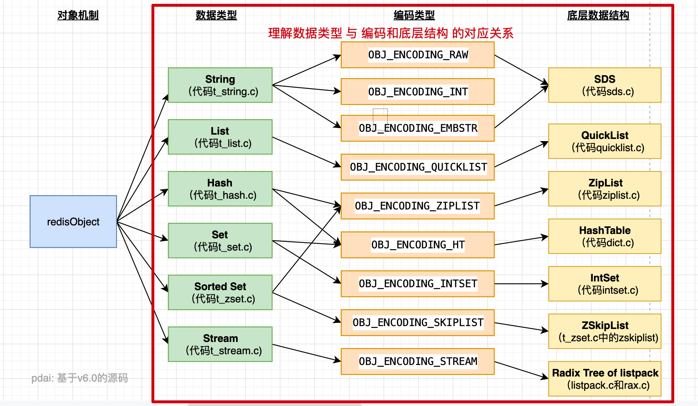

## Redis

scan 
字符串类型：它的big体现在单个value值很大，一般认为超过10KB就是bigkey。
非字符串类型：哈希、列表、集合、有序集合，它们的big体现在元素个数太多。一次性取出时
redis-cli --bigkeys  有风险! 在slave 本机执行，避免网络开销
可以使用 --i 0.1 代表100毫秒执行一次

debug object ${key}命令获取键值的相关信息

### 数据类型和底层数据结构

+ 字符串String 
    + int 编码：保存的是可以用 long 类型表示的整数值。
    + embstr 编码：保存长度小于44字节的字符串（before redis3.2 39字节）。
    + raw 编码：保存长度大于44字节的字符串（before redis3.2 39字节）。 
+ 集合Set  
+ 哈希Hash  
+ 列表List  
+ 有序集SortedSet    
    + 使用ziplist 编码：保存的元素数量小于128； 保存的所有元素长度都小于64字节    
    + 其实有序集合单独使用字典或跳跃表其中一种数据结构都可以实现，但是这里使用两种数据结构组合起来，原因是假如我们单独使用 字典，虽然能 以 O(1) 的时间复杂度查找成员的分值，但是因为字典是以无序的方式来保存集合元素，所以每次进行范围操作的时候都要进行排序；假如我们单独使用跳跃表来实现，虽然能执行范围操作，但是查找操作有 O(1)的复杂度变为了O(logN)
 
+ 简单动态字符串（SDS）  
+ 字典   
+ 链表  
+ 跳跃表  
    * 有很多层组成，由上到下节点数逐渐密集，最上层的节点最稀疏，跨度也最大。
    * 每一层都是一个有序链表，只扫包含两个节点，头节点和尾节点。
    * 每一层的每一个每一个节点都含有指向同一层下一个节点和下一层同一个位置节点的指针。
    * 如果一个节点在某一层出现，那么该以下的所有链表同一个位置都会出现该节点。
+ 整数集合  
+ 压缩列表  

### Redis做异步队列么
使用list结构作为队列，rpush生产消息，lpop消费消息。当lpop没有消息的时候，要适当sleep一会再重试。  
可不可以不用sleep呢？list还有个指令叫blpop，在没有消息的时候，它会阻塞住直到消息到来。 
能不能生产一次消费多次呢？使用pub/sub主题订阅者模式，可以实现1:N的消息队列。    
pub/sub有什么缺点？在消费者下线的情况下，生产的消息会丢失，得使用专业的消息队列如rabbitmq等。

### redis如何实现延时队列
使用sortedset，拿时间戳作为score，消息内容作为key调用zadd来生产消息，消费者用zrangebyscore指令获取N秒之前的数据轮询进行处理。

## LevelDB -> RocksDb -> TiDB 

### LevelDB 
这不是一个 SQL 数据库，它没有关系数据模型，不支持 SQL 查询，也不支持索引。  
同时只能有一个进程访问一个特定的数据库。  没有内置的 client-server 支持。    
相对于Redis ， 它只支持Key-Value ，数据类型少。
