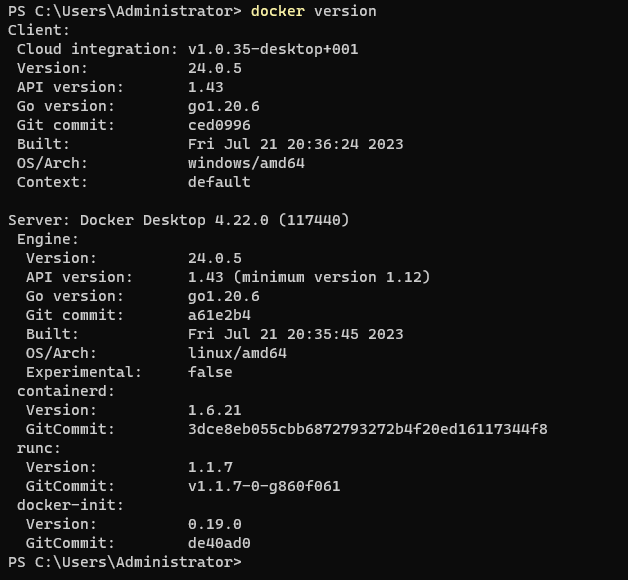

# Docker

## 题记  
这二天闲的无事，折腾一下我的笔记本，本来先打算装个linux 环境。
研究了vagrant , virtualbox, WSL ，最后决定研究下docker。
然后发现有个Docker Destop, 先把它装了再说。
安装时查看了下系统需求， 好险，我的系统版本刚好达到。
需要升级WSL

运行docker Desktop 成功了

## 课程笔记
解决了什么问题
开发和运行环境不一致

仓库名，TAG 都是<none> 的镜像， 叫作虚悬镜像

## 基本概念
Image 镜像
Container 容器
Repository 仓库 hub.docker.com

client - server 架构 
client 发命令给server ， server守护进程执行命令
## 命令
docker images 
docker search 
docker pull
docker ps -a
docker run -it ubuntu /bin/bash 
docker run -d ubuntu 
ctrl + p + q
docker start | stop | restart 
docker attach 
docker exec -it 
docker container prune 移除所有未运行容器
docker build 

docker top 
docker inspect 

