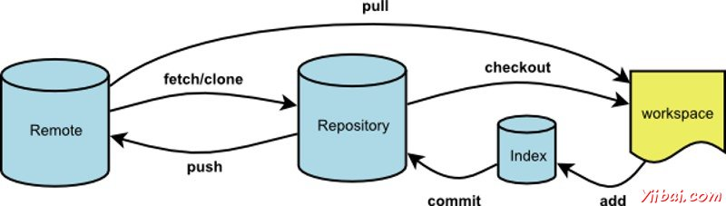
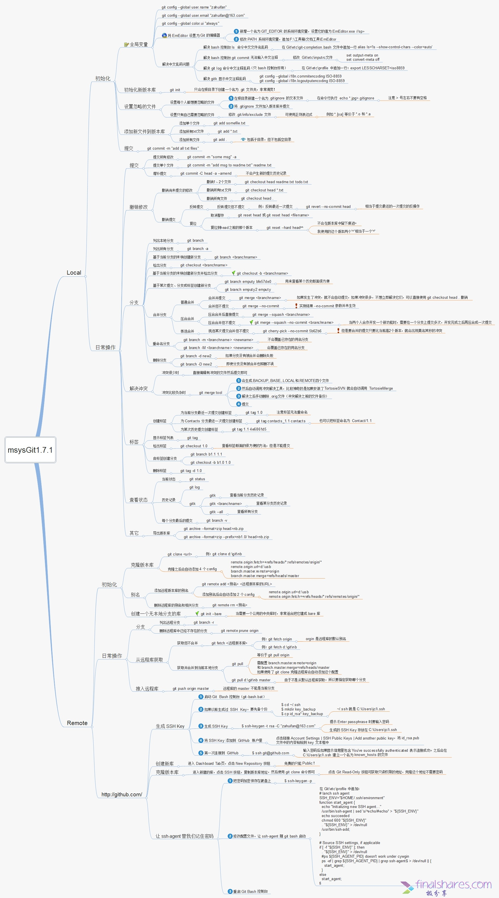

# Git 

## 常用命令
git clone rep  
git checkout branch_name  

git status  
git log  
git add edit_file  
git commit edit_fime -m "commit reason"  
git push origin remote  
git pull 
git config --global user.email "example@example.com"  
git config --global user.name "Your name"  
git diff --cached
dit diff --staged

## git reset
git reset --soft 仅移动HEAD 指针，不会改会暂存区，工作区内容  
git reset --mixed 移动HEAD 指针，改变暂存区内容，但不会改变工作区
git reset --hard HEAD 指针，暂存区，工作区都改变  
git checkout abc.txt 回滚工作区
## git remote 
git remote add origin remote@remote.com:/remote.git  
git push -u origin master   
git remote show origin
## git branch
git branch 列出分支  
git checkout branch_name 切换到分支  
git checkout -b newbrachname  
git branch -av  

# git work flow

# git command

