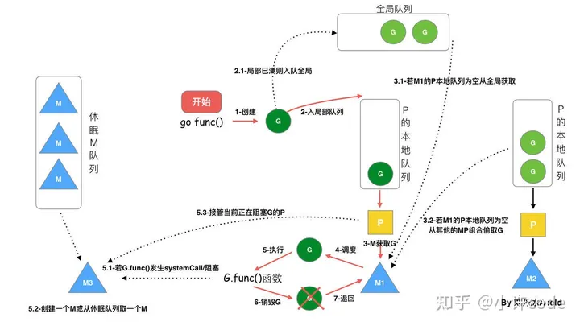
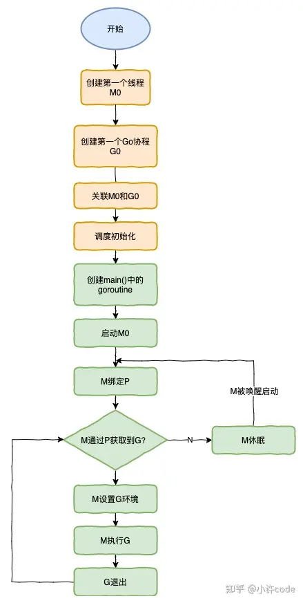

# GMP

G：goroutine，⼀个计算任务。由需要执⾏的代码和其上下⽂组成，上下⽂
包括：当前代码位置，栈顶、栈底地址，状态等。
M：machine，系统线程，执⾏实体，想要在 CPU 上执⾏代码，必须有线
程，与 C 语⾔中的线程相同，通过系统调⽤ clone 来创建。
P：processor，虚拟处理器，M 必须获得 P 才能执⾏代码，否则必须陷⼊休
眠(后台监控线程除外)，你也可以将其理解为⼀种 token，有这个 token，才
有在物理 CPU 核⼼上执⾏的权⼒。

---
G:表示goroutine，每个goroutine都有自己的栈空间，定时器，初始化的栈空间在2k左右，空间会随着需求增长。

M:抽象化代表内核线程，记录内核线程栈信息，当goroutine调度到线程时，使用该goroutine自己的栈信息。

P:代表调度器，负责调度goroutine，维护一个本地goroutine队列，M从P上获得goroutine并执行，同时还负责部分内存的管理。
* 全局队列（Global Queue）：存放等待运行的 G。  
* P 的本地队列：同全局队列类似，存放的也是等待运行的 G，存的数量有限，不超过 256 个。新建 G’时，G’优先加入到 P 的本地队列，如果队列满了，则会把本地队*列中一半的 G 移动到全局队列。  
* P 列表：所有的 P 都在程序启动时创建，并保存在数组中，最多有 GOMAXPROCS(可配置) 个。    
* M：线程想运行任务就得获取 P，从 P 的本地队列获取 G，P 队列为空时，M 也会尝试从全局队列拿一批 G 放到 P 的本地队列，或从其他 P 的本地队列偷一半放到自己 P 的本地队列。M 运行 G，G 执行之后，M 会从 P 获取下一个 G，不断重复下去。  

* M 与 P 是 1：1 的关系

# go func 调度过程

## 工具
go tool trace

# chan
## 异常
如果给一个 nil 的 channel 发送数据，会造成永远阻塞。
如果从一个 nil 的 channel 中接收数据，也会造成永久阻塞。
给一个已经关闭的 channel 发送数据， 会引起 panic
从一个已经关闭的 channel 接收数据， 如果缓冲区中为空，则返回一个零
值。

## 底层结构

使用了 ring buffer（环形缓冲区) 来缓存写入的数据。

### 终止一个协程
runtime.Goexit()

