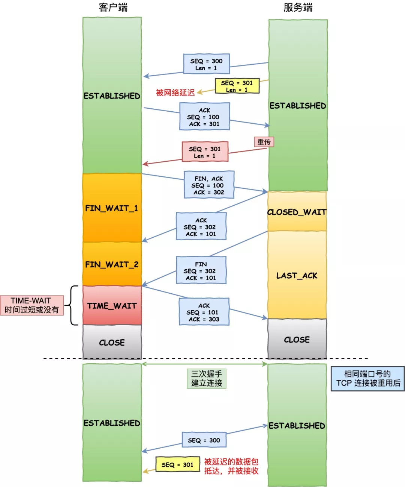
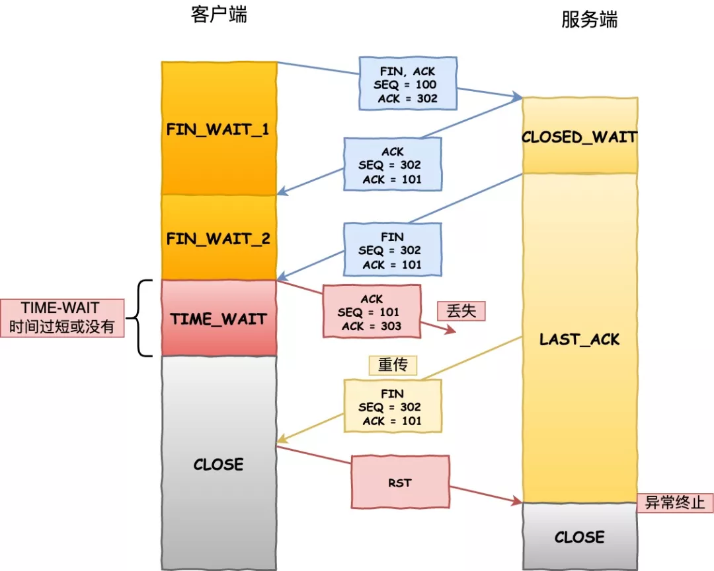

# tcp 

## 三次握手 
「第一次握手」 ：客户端先向服务端发送一个请求连接的报文段，这个报文段SYN位设置为1,序列号Seq设置为某一值，假设为X，发送出去之后客户端进入SYN_SEND状态，等待服务器的确认；

「第二次握手」 ：服务器收到客户端的SYN报文段，需要对这个SYN报文段进行确认，设置Ack X+1；同时，自己自己还要发送SYN请求信息，将SYN位置为1，Seq为Y；服务器端将上述所有信息放到一个报文段（即SYN+ACK报文段）中，一并发送给客户端，此时服务器进入SYN_RECV状态；

「第三次握手」 ：客户端收到服务器的SYN+ACK报文段。然后将Ack 设置为Y+1，向服务器发送ACK报文段，这个报文段发送完毕以后，客户端和服务器端都进入ESTABLISHED状态，完成TCP三次握手。

## 四次挥手
「第一次分手」 ：主机1，设置序列号Seq和确认包ACK，假设seq为x+2,ACK=y+1,再将FIN标志位设置为1,向主机2发送FIN报文段；之后主机1进入FIN_WAIT_1状态；这表示主机1没有数据要发送给主机2了；

「第二次分手」 ：主机2收到了主机1发送的FIN报文段，向主机1回一个ACK报文段(其值为接收到的FIN报文的seq值+1)；主机1进入FIN_WAIT_2状态,等待主机二的断开请求包FIN；

「第三次分手」 ：主机2向主机1发送FIN报文段，意思是我可以断开连接了,请求关闭连接，同时主机2进入CLOSE_WAIT状态；

「第四次分手」 ：主机1收到主机2发送的FIN报文段，向主机2发送ACK报文段,值为刚刚接收到的FIN包Seq值+1，然后主机1进入TIME_WAIT状态；主机2收到主机1的ACK报文段以后，就关闭连接；此时，主机1等待2MSL后依然没有收到回复，则证明Server端已正常关闭，那好，主机1也可以关闭连接了。

## 为什么要设计 TIME_WAIT 状态
原因一：防止历史连接中的数据，被后面相同四元组的连接错误的接收  

原因二：保证「被动关闭连接」的一方，能被正确的关闭  ， 断开连接一方太早close 状态， 被动方可能没有收到最后的 ack , 重发后面状态就坏了

## tcp_tw_reuse 风险
开启 tcp_tw_reuse 风险，因为快速复用 TIME_WAIT,  状态的端口，导致新连接可能被回绕序列号的 RST 报文断开了，而如果不跳过 TIME_WAIT 状态，而是停留 2MSL 时长，那么这个 RST 报文就不会出现下一个新的连接。

