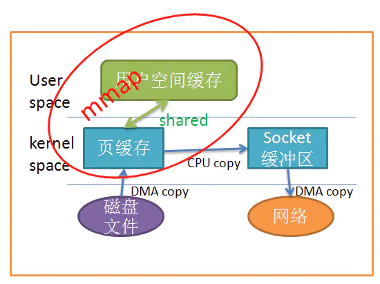

# Zero Copy

用户缓冲区 <-> 内核缓冲区 <-> IO设备
二次内存拷贝

零拷贝的目标有以下二个  
+ 避免数据拷贝  
    * 避免操作系统内核缓冲区之间进行数据拷贝操作。  
    * 避免操作系统内核和用户应用程序地址空间这两者之间进行数据拷贝操作。
    * 用户应用程序可以避开操作系统直接访问硬件存储。
    * 数据传输尽量让 DMA 来做。
* 将多种操作结合在一起
    * 避免不必要的系统调用和上下文切换。
    * 需要拷贝的数据可以先被缓存起来。
    * 对数据进行处理尽量让硬件来做。  

## mmap
将读缓冲区和用户缓冲区地址进行映射，内核和应用共享这块缓冲区，从而减少了读缓冲区到用户的缓冲区的一次拷贝。

要注意的点:  
* mmap的文件被其它文件更改，截断 发生sigbus信号中断，解决方式：
    * 处理sigbus 
    * 对文件加锁 （推荐）
    * 使用sendfile （linux kernal 2.1）

## sendfile
只能从文件传输到套间字  

ssize_t sendfile(int out_fd, int in_fd, off_t *offset, size_t count);  
out_fd 必须是socket
in_fd 必须是可以mmap的file

## splice
基于linux 管道缓冲机制的复制 kernal 2.6.21

## O_DIRECT flag 

kernal 2.4.10
绕过操作系统的page cache, 直接进入通用块设备层

# Copy On Write

